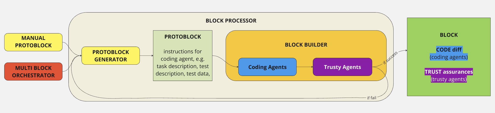

# Trusty Agentic Chains (tac)

Trusty Agentic Chains (tac) is a AI-driven coding framework that leverages *coding agents* with *trusty agents*. *Coding agents* implement desired changes in a codebase and *trusty agents* generate trust assurances, by means of empirical verifications. For instance, a trusty agent could run unit tests or even execute the software and look at it carefully. If one of the trusty agents protests, the analyzed issue goes back to the coding agents until they fix it for real. We coin the result of each successful operation as a *block*, and a block consists of code changes and trust assurances and is ready to be merged into the codebase. Thus you can think of tac as a blockchain for code changes, but actually useful. For a detailed technical overview of the system architecture and methodology, please refer to our [whitepaper](docs/whitepaper.md).

> **Warning** ⚠️  
> This project is in **alpha**. Interfaces, commands, and features may change without notice. Use at your own risk and do not use in production environments. 

## 🏗️ Architecture

### Coding Agents
These agents generate and modify code based on your instructions:
- **Aider Agent**: Leverages the aider-chat library for code generation [https://aider.chat/]
- **Native Agent**: Our lightweight in-house implementation for code generation

### Trusty Agents
These agents validate and verify the code changes:
- **Pytest Agent**: Runs software tests and analyzes results to ensure functionality
- **Plausibility Agent**: Evaluates if code changes match the requested functionality
- **Performance Agent**: Benchmarks code and guides performance optimization
- **(coming soon):** visual agent, able to look at graphics
- **(more trusty agents coming soon...)**

### Block execution flow
* **Block**: A valid block is defined as a change in code (diff) and trust assurances (e.g. passing unit tests)
* **ProtoBlock**: Standardized specification for a coding task, containing task description, test specifications, and files to modify
* **BlockExecutor**: Executes the changes specified in a ProtoBlock and validates them with trusty agents
* **BlockBuilder**: Transforms a ProtoBlock into a finalized Block by implementing the requested changes and obtaining the trust assurances
* **ProtoBlockGenerator**: Creates structured ProtoBlocks from high-level task instructions
* **BlockProcessor**: Runs in a loop to execute ProtoBlocks, handling retries
* **MultiBlockOrchestrator**: Splits complex tasks into smaller, manageable chunks that can be executed sequentially
tac operates through a chain of specialized agents working together:

## 🚀 Installation

1. **Clone this repository** (or download it) to your local machine:

   ```bash
   git clone git@github.com:lunarring/tac.git
   cd tac
   ```

2. Activate your environment (e.g. conda):
   ```bash
   conda activate your_env_name
   ```

3. Install via pyproject.toml

   ```bash
   pip install -e .
   ```
   
4. Make sure you have a valid API key for OpenAI in your environment:
   ```bash
   export OPENAI_API_KEY=your_key_here
   ```
   Or add it to your .env file if you prefer

## ⚙️ Usage

Usually, you are running tac from your terminal and are within your project root. You need git to run tac fully, as the plausibility trusty agent requires git diffs. 

### Create and Execute Tasks

Execute tasks including automated testing using a simple command:

```bash
# Execute a task with specific instructions
tac make "your instructions here"

# Examples:
tac make "refactor this spaghetti code into something a human might understand"

# Optional: Specify a different directory (default is current directory)
tac make "your instructions" --dir ./your/code/directory

# Optional: Load from a JSON protoblock file
tac make --json path/to/protoblock.json

# Optional: Choose a specific coding agent
tac make "your instructions" --agent native
```

### Selecting Agents

TAC allows you to choose which agents to use for your tasks:

```bash
# Use the native coding agent
tac make "your task" --agent native

# Use the aider coding agent (default)
tac make "your task" --agent aider

# Disable plausibility testing
tac make "your task" --plausibility-test false

# Set minimum plausibility score
tac make "your task" --minimum-plausibility-score B
```

### Git Integration

TAC will create a new branch with an id (e.g., tac/buxfix/refactor_spaghetti_code) where it will commit all changes IF everything worked out. If not, you'll have to manually switch back to your previous branch. 

If you don't want to use the git integration, tac will switch to a FakeGitManager that emulates git in temp directories. 

### Voice Interface (Experimental)

TAC now includes an experimental voice interface that allows you to interact with the system using speech:

```bash
tac voice
```

> **Note**: The voice interface is currently experimental and only works without the orchestrator. It may require additional setup for speech recognition and synthesis. 

### View Blocks and Logs

View execution logs interactively:

```bash
tac view
```

This command provides an interactive interface to:
- Browse and read log files from previous TAC executions
- View log entries with syntax highlighting based on log level
- Navigate through logs with an easy-to-use interface
- Search for specific text within logs
- Jump to section headings for easier navigation
- See the current section heading while browsing logs


### Test Management

The framework provides several test-related commands:

```bash
# Run tests (because trust, but verify)
tac test run [--directory tests]

# List available tests
tac test list [--directory tests]

```

### Performance Optimization

Optimize specific functions in your codebase using the Performance Trusty Agent:

```bash
# Optimize a specific function
tac optimize function_name
```

### Code Summarization

TAC can analyze and summarize your codebase to help AI agents better understand it:

```bash
# Gather and summarize Python files
tac gather ./src/tac --summarize

# View file summaries
tac gather ./src/tac
```

## ⚙️ Configuration

The framework uses a built-in configuration system with sensible defaults that can be overridden via command-line arguments:

```bash
# Example: Override configuration values
tac make "your task" --plausibility-test false --max-retries 5
```

### Configuration System

TAC uses a hierarchical configuration system (in `src/tac/core/config.py`) with several categories:

- **GeneralConfig**: Core settings like agent type, orchestration, and testing parameters
  ```python
  agent_type: str = "native"           # Which coding agent to use
  use_orchestrator: bool = True        # Whether to use the task orchestrator
  plausibility_test: bool = True       # Enable/disable plausibility testing
  minimum_plausibility_score: str = "B" # Minimum grade for plausibility
  max_retries_block_creation: int = 4  # Maximum retry attempts for block creation
  max_retries_protoblock_creation: int = 4  # Maximum retry attempts for protoblock creation
  ```

- **GitConfig**: Version control settings
  ```python
  enabled: bool = True                 # Enable/disable git integration
  auto_commit_if_success: bool = True  # Auto-commit successful changes
  auto_push_if_success: bool = True    # Auto-push successful changes
  ```

- **LLMConfig**: Language model settings for different strength levels
  ```python
  provider: str = "openai"             # LLM provider (openai, anthropic)
  model: str = "o3-mini"               # Model name
  ```

- **AiderConfig**: Settings specific to the Aider coding agent
  ```python
  model: str = "openai/o3-mini"        # Model used by Aider
  reasoning_effort: str = "high"       # Reasoning level for Aider
  ```

### Command-line Options

Key configuration options include:
- `--agent`: Choose between "aider" or "native" coding agents
- `--plausibility-test`: Enable/disable plausibility testing
- `--max-retries`: Maximum number of retry attempts
- `--git-enabled`: Enable/disable git integration
- `--model`: Specify the LLM model to use
- `--minimum-plausibility-score`: Set the minimum grade (A-F) for plausibility tests
- `--use-orchestrator`: Enable/disable the task orchestrator
- `--reasoning-effort`: Set reasoning effort level (low, medium, high)

All configuration options are documented in the command help:
```bash
tac --help
```

## ✍️ Contributing

Since this project is alpha, contributions, suggestions, and bug reports are highly encouraged. Ideally get in touch with Johannes, as the project is currently in closed alpha stage. We promise to read your pull requests...
